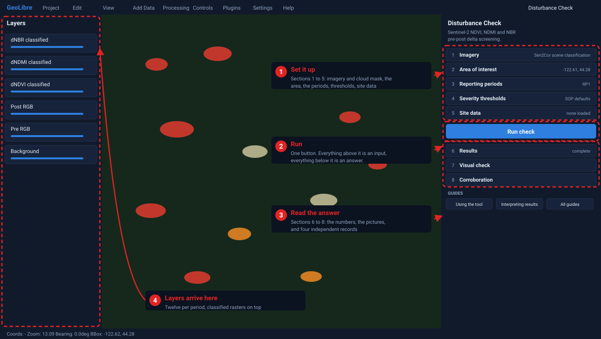
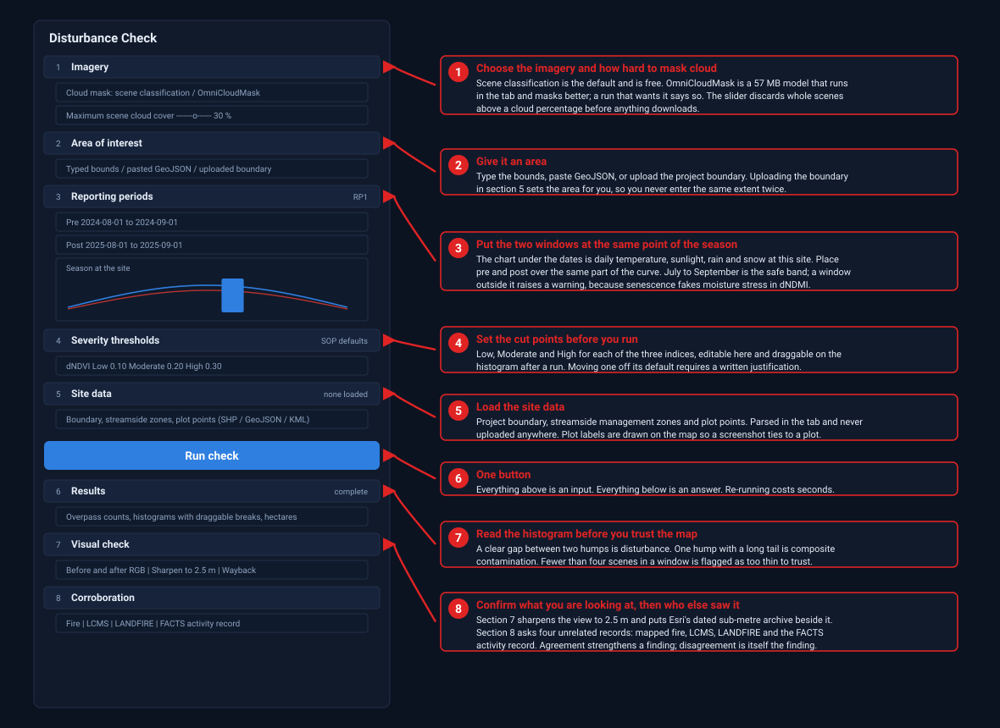

# Disturbance Check

Sentinel-2 NDVI, NDMI and NBR pre-post delta screening for ACR IFM verification,
as a browser-based [GeoLibre](https://github.com/opengeos/GeoLibre) plugin.

This is a canopy change detection tool implemented as a panel. It produces
the same classified rasters and histograms as the QGIS and geemap workflow it
replaces, with no QGIS install, no Python environment and no plugin setup.

**It needs no account.** Imagery is read straight from the Copernicus Sentinel-2
L2A archive published as cloud-optimised GeoTIFFs on AWS Open Data, found
through Element 84's public Earth Search catalogue. Both answer anonymous
requests, so there is no sign-in, no Cloud project, no OAuth client, no
test-user list and no billing. Composites, indices, deltas, histograms and
classification are all computed in the browser tab.

Outputs complement, but do not replace, ground plots and developer monitoring
reports.

## Cheat sheet

Everything the tool does sits in one panel on the right, in three blocks. The
five sections above the button are what you give it, the button runs the check,
and the three below are what it gives back. Nothing else is needed to run one.



| | Section | What you do there |
|---|---|---|
| **Set it up** | 1 Imagery | Pick the cloud mask. Scene classification is the default and costs nothing; OmniCloudMask is a 57 MB model that runs in the tab and masks better. Set the cloud ceiling, which throws out whole scenes before anything downloads. |
| | 2 Area of interest | Type bounds, paste GeoJSON, or upload the project boundary. Uploading the boundary in section 5 sets this for you. |
| | 3 Reporting periods | Pre and post windows, one pair or many. The chart underneath is daily temperature, sunlight, rain and snow at the site, so put both windows over the same part of the curve. July to September is the safe band. |
| | 4 Severity thresholds | Low, Moderate and High cut points for each of the three indices. Editable here before the first run, draggable on the histogram after it. Moving one off its default requires a written justification. |
| | 5 Site data | Project boundary, streamside management zones and plot points, as zipped shapefile, GeoJSON or KML. Parsed in the tab and never uploaded anywhere. |
| **Run** | Run check | One button. Everything above it is an input, everything below it is an answer. Re-running costs seconds. |
| **Read it** | 6 Results | Overpass counts, a histogram per index with draggable breaks, and hectares per class. Read the histogram before you trust the map. |
| | 7 Visual check | Before and after true colour, sharpenable to 2.5 metres, beside Esri's dated sub-metre archive. This is where you find out what the changed pixels actually are. |
| | 8 Corroboration | The same ground as four unrelated records: mapped fire, LCMS, LANDFIRE and the Forest Service activity record. |



Three things decide whether a run is trustworthy, and all three are visible in
the panel. The windows must sit at the same point of the season, or phenology
alone will produce a delta. Each window needs at least four scenes, and fewer is
flagged. The histogram must show two humps with a gap between them; one hump
with a long tail is composite contamination rather than disturbance.

Layers arrive in the Layers panel on the left, twelve per period, classified
rasters on top. Take a screenshot of anything you want to keep.

## Documentation

The [documentation library](docs/README.md) is the same set of guides that ships
inside the app, reachable from the **Disturbance Check** menu in the toolbar and
from the Help footer at the bottom of the tool panel.

Start with [Using the tool](docs/using-the-tool.md) if you are running a check,
[Data and access](docs/data-access.md) if you want to know where the imagery
comes from.

## The panel

Eight sections, in order:

1. **Imagery** — where the data comes from and which cloud mask is running.
2. **Area of interest** — typed bounds, pasted GeoJSON, or an uploaded project
   boundary.
3. **Reporting periods** — pre and post windows, one or many, plus the cloud
   ceiling, with the daily climate at the site drawn under them so the windows
   can be placed at matching points of the season.
4. **Severity thresholds** — the Low, Moderate and High cut points for each of
   the three differenced indices, editable before the first run.
5. **Site data** — project boundary, streamside management zones, and plot
   points, uploaded as zipped shapefile, GeoJSON or KML.
6. **Results** — overpass counts, histograms with draggable breaks, class areas.
7. **Visual check** — the run's own before-and-after true colour on the 20 m
   working grid, optionally sharpened to 2.5 m, beside Esri's dated
   high-resolution archive.
8. **Corroboration** — the same ground as four independent records: mapped
   fire, LCMS change, LANDFIRE disturbance agent, and the FACTS management
   record.

## How it works

The operator sets an area of interest and one or more reporting periods. The
panel then, per period:

1. Asks Earth Search which Sentinel-2 scenes cover the area in each window, and
   folds them into overpasses so a scene published in two UTM zones is not
   counted twice.
2. Reads only the pixels it needs, by HTTP range request, out of the
   cloud-optimised GeoTIFFs, correcting the +1000 DN baseline offset on any
   scene the catalogue reports still carrying it.
3. Masks cloud, shadow and snow, then reduces each window to a per-pixel
   median. The mask is the scene classification layer by default, or
   OmniCloudMask, a 57 MB model run in the tab, when a run asks for it.
4. Derives NDVI, NDMI and NBR, and the three deltas, masking water at the delta
   stage so the RGB layers keep water for context.
5. Accumulates a fixed histogram over every pixel and reads its shape.
6. Classifies each delta into Low, Moderate and High.
7. Counts per-class hectares on the native Sentinel-2 UTM grid, clipped to the
   boundary polygon rather than its bounding box.
8. Paints twelve layers per period and adds them to GeoLibre, classified
   rasters on top.

Nothing about the analysis is hidden in the tool. Every constant traces to a
section of the SOP in [`src/defaults.ts`](src/defaults.ts).

## Severity classes

Each differenced index is cut into four classes: undisturbed, Low, Moderate and
High. Undisturbed pixels are masked server-side, so the classified rasters
arrive with transparency already in them and only disturbed cells are drawn over
the site.

The thresholds ship as the SOP Step 6 defaults and are editable in the opening
panel, before the first run, so a colleague can set them for their own site
without waiting for a result. After a run they can also be dragged directly on
each histogram, against the distribution they are cutting. Either way, a value
moved off its default marks that index as adjusted and requires a written
justification, which is saved with the project. Ordering is enforced, so
Low can never cross Moderate.

## Site data

Project boundary, streamside management zones and plot points load from a zipped
shapefile, a GeoJSON file, or a KML. Files are parsed in the browser and are
never uploaded anywhere.

Plot points are labelled on the map with their identifier, so a screenshot of a
disturbance polygon can be tied to a plot without a separate legend. The
identifier column is detected automatically, preferring plot-specific names like
`Plot ID` or `PLOT_NO` over generic ones like `OBJECTID`, and the detected field
is always shown and always overridable. Loading a project boundary also sets it
as the area of interest, rather than making the operator supply the same extent
twice.

## Seeing the ground

Sentinel-2 at 10 metres tells you an index changed. It cannot tell you what
changed, because a road, a landing, a cutblock edge and a blowdown patch are all
the same handful of pixels. Section 7 answers that question two ways on one
screen.

The tool's own before-and-after true colour is built from the same masked
observations the indices were built from, on the 20 metre working grid, so it
shows the composite that actually produced the number. Either view can be
sharpened to 2.5 metres by SEN2SRLite, a 236 kB model run in the tab on WebGPU
where the browser offers it and WebAssembly where it does not. Sharpening is a
separate pass over the archive and never feeds the analysis; hectare counts keep
reading the 20 metre grid, so an invented pixel can change what a verifier sees
but not what the tool certifies.

Beside it sits Esri's World Imagery Wayback, the dated archive of that basemap,
frequently sub-metre and served anonymously. It replaces the Google Earth
historical timeline the SOP leans on, and it needs no account.

## Corroboration

Section 8 puts the same ground against four records built by other people from
other data, none of which is ever an input to the calculation.

Mapped fire comes from three registries with different jobs: MTBS, which assesses
severity from imagery a year or more after the event; the interagency perimeter
feed, which is same-season and covers the years MTBS has not reached; and the
Canadian National Burned Area Composite, which runs from 1972 and carries
projects north of the border. LCMS, the Forest Service Landscape Change
Monitoring System, classifies change annually across the conterminous United
States from the full Landsat and Sentinel-2 record by a method unlike this
tool's. LANDFIRE names the cause where LCMS only names the change, with Fire,
Clearcut, Harvest, Thinning, Mastication, Insects, Disease and Weather as
distinct classes. FACTS is different in kind from the other three, because it is
not a measurement of the canopy but the record of what was done, entered by the
people who did it, with a date and an acreage.

Agreement between an unrelated method and a threshold this tool set is worth
more than either alone. Disagreement is the finding.

## What it checks

The SOP's hard-won lessons are encoded as diagnostics rather than left to
memory:

- **Dormant-season windows.** A window outside July to September raises a
  warning, because senescence drives SWIR1 reflectance up before leaf-fall and
  produces a uniform false moisture-stress signal in dNDMI.
- **Mismatched pre and post windows.** Phenology drift between periods is the
  most common source of fake inter-period change.
- **Histogram shape.** A unimodal distribution with a long right tail and no gap
  is flagged as composite contamination, not disturbance. A bimodal
  distribution with a clear gap suggests where the Low break belongs.
- **Thin composites.** Fewer than four scenes per window is flagged, because the
  median normaliser is unstable below that.
- **Reversed coordinates.** Bounds are normalised, so a swapped east and west
  cannot silently produce an empty geometry.

Moving a class break off its default marks the delta as adjusted and requires a
written justification, which is saved with the project.

## Nothing expires

Earlier versions served map tiles against an access token that lapsed after an
hour, and the layers went with it. The layers are now images the tab painted, so
they last as long as the tab does.

Only parameters are saved into a project, never results, which means a saved
project is a description of a check rather than a snapshot of one. Re-running it
costs seconds and needs no credentials.

## Deployment

The published site is a GeoLibre web build with this plugin baked in, served
from GitHub Pages at
<https://seamusrobertmurphy.github.io/disturbance-checker/>. GeoLibre is not
vendored here; the deploy workflow checks it out at a pinned tag, drops in the
built plugin, builds, and publishes.

No secrets are required. Set Pages to build from GitHub Actions and push; see
[`docs/first-run.md`](docs/first-run.md).

Bump `GEOLIBRE_REF` in [`.github/workflows/deploy.yml`](.github/workflows/deploy.yml)
to move to a newer GeoLibre.

## Development

```bash
npm install
npm run build     # typecheck, then bundle to dist/
npm test          # load the bundle and assert the plugin contract and SOP defaults
npm run package   # produce the drop-in layout under build/
```

To try it against a local GeoLibre checkout, run `npm run package`, then copy
`build/tuvsud-disturbance-check/` into
`apps/geolibre-desktop/public/plugins/` and restart the GeoLibre dev server.
Discovery happens at build and dev-server start, so a restart is required after
adding or updating the folder.

The plugin is one self-contained ES module because GeoLibre's external-plugin
loader executes the entry through a blob import and does not resolve relative
imports inside the bundle. Its three runtime dependencies are `geotiff` for
reading cloud-optimised GeoTIFFs, `proj4` for the UTM transforms and `shpjs`
for boundary imports, all MIT.

## Licence

MIT. See [LICENSE](LICENSE).
