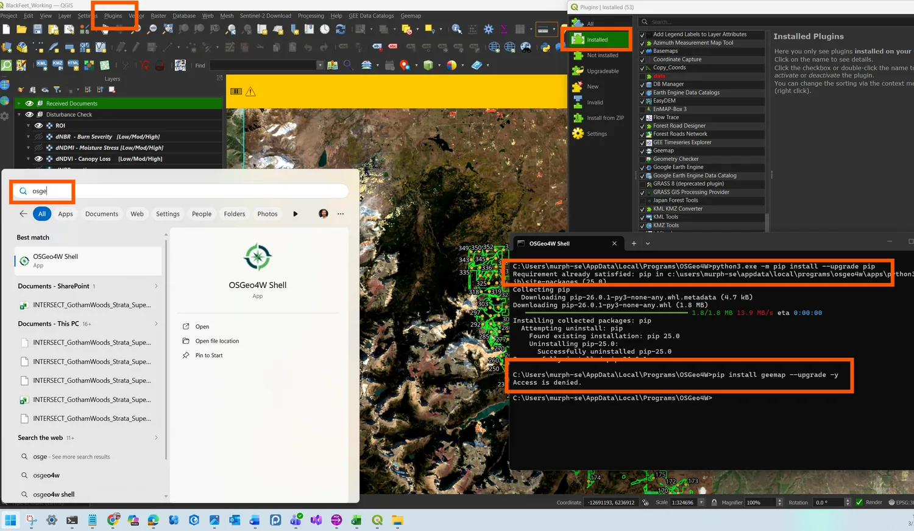
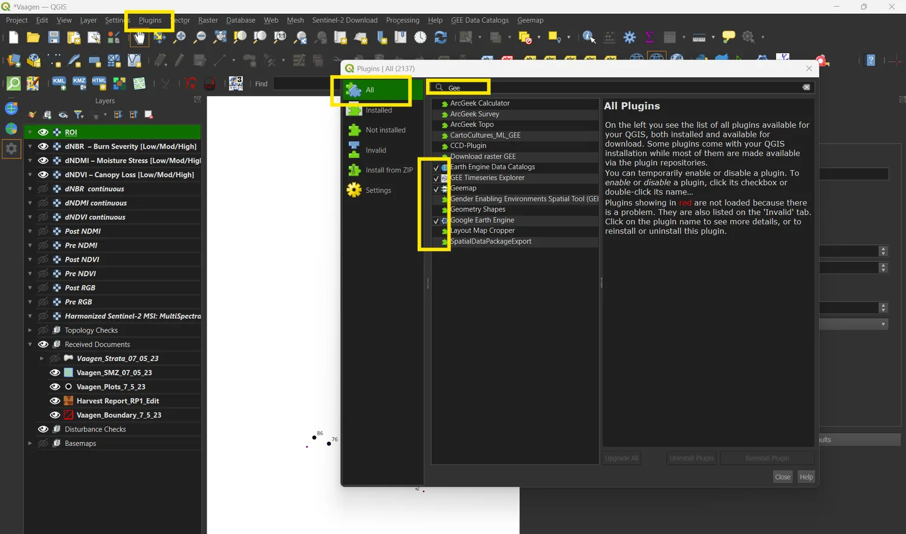

# From QGIS to the browser

What this tool replaces, what it keeps, and what it deliberately does not do.
Written for anyone who ran the disturbance check the old way and wants to know
what changed underneath.

## The short version

In the QGIS workflow nothing ran on your machine. Every composite, index, delta,
histogram and classification executed on Google's servers, and QGIS was an
authentication shell, a code pane and a tile viewer.

In this tool nothing runs on anyone's server. The browser reads Sentinel-2
pixels straight out of a public archive and does the arithmetic itself.

So the work has moved twice, and it now sits closer to you than it ever did in
the desktop GIS. What went with it is every piece of apparatus that existed to
obtain and hold a Google credential.

## What the old workflow required

Steps 1 and 2 of the SOP, before any analysis begins.

*The failure mode that cost the most support time. `pip install geemap` against
the QGIS-bundled Python, refused for want of an elevated shell. If pip resolved
to system Python instead, the plugin imported but `ee` was missing at runtime,
which produced a different and less obvious error later.*

Then three plugins, activated together and in the right order:

*Google Earth Engine, GEE Data Catalog and Geemap, all three active. The Layers
panel on the left is the stack the script produces, and it is the same stack the
browser tool builds today.*

Then binding a Cloud project in the plugin settings, an OAuth round trip through
the system browser, and a credentials cache that expired after roughly seven
days and had to be refreshed with `ee.Authenticate(force=True)`.

Only then could the script be pasted into the code pane and run:

*Script on the right, Run Code dispatching to Earth Engine, layers appearing on
the left. Everything to the left of this point was setup.*

## What replaced it

| Old | New |
|---|---|
| Install Python packages into the QGIS Python | Nothing to install |
| Three QGIS plugins, activated in order | One plugin, one toggle |
| Bind the project in plugin settings | Nothing to bind |
| OAuth through the system browser, cached 7 days | No account of any kind |
| Paste a script and edit four constants | Form fields with validation |
| Read the histogram in a matplotlib window | Histogram in the panel with draggable breaks |
| Record thresholds by hand in a workbook | Run manifest, generated |
| Layer names typed into `m.addLayer` calls | Same stack, built automatically |

The four constants at the top of the script became the first three panel
sections. The class breaks in `classify_delta_*()` became section 4. The
`m.addLayer` block at the end became the layer sync.

## What is the same

Deliberately identical, so results are comparable across the two:

- Sentinel-2 L2A surface reflectance, divided by 10000, clipped to the ROI.
- NDVI on B8/B4, NDMI on B8/B11, NBR on B8A/B12.
- Water masked at the delta stage, not on the composite, so the RGB layers keep
  their water for context.
- dNDVI and dNDMI as pre minus post; dNBR as post minus pre.
- 130 fixed histogram bins from -0.5 to 0.8, at 20 m.
- The class breaks, unchanged, including the different dNDMI ramp.
- The visualisation palettes and ranges, including the RGB gamma of 1.2.

Full detail in [methods.md](methods.md), including a table of the places where
the SOP PDF, the QGIS script and the ArcGIS script disagree with each other.

## What is different, and why

**Cloud masking is weaker, and this is the one that matters.** The scripts rank
every pixel on Cloud Score+ and keep the single clearest observation. That score
is a Google product and exists only inside Earth Engine. This build masks on the
Sen2Cor scene classification and takes a median instead, which is the SOP's own
documented alternative. Thin cloud survives more often, and the SOP's floor of
four clear scenes has gone from advisory to binding. Read the overpass counts.

**Water comes from the scene classification, not JRC Global Surface Water.** GSW
is an Earth Engine asset with no open equivalent. The two disagree on seasonal
water.

**The histogram has no ceiling.** The scripts reduce to a `maxPixels` limit and
truncate past it, which the SOP records happening silently at 1e9 on wide areas.
Here every pixel is counted, so there is nothing to truncate and no limit to
raise.

**Areas are counted, not integrated.** The grid is the native Sentinel-2 UTM
grid, so a pixel is exactly 20 by 20 m and hectares are a multiplication. The
scripts had to pass an explicit projection to every area reduction to avoid
measuring on a degree grid.

**Bounds cannot be reversed.** The script's `ee.Geometry.Rectangle` accepts
reversed coordinates and returns an empty geometry with no error. The tool
normalises them.

**Thresholds are recorded.** Moving a break off its default requires a written
justification that lands in the manifest, rather than a note in a workbook that
may or may not be written.

**Nothing is exported.** Step 9 and 12 of the script queue GeoTIFF exports to
Drive. That is not implemented here, and it is the largest deliberate gap.

## What the old workflow still does better

**Export.** Batch export to Drive or Cloud Storage, at 10 m, outliving the
session. If you need archived rasters, run the script.

**Cloud Score+.** The best cloud masking available for Sentinel-2, and it is not
reachable from a browser. This is the real cost of the move.

**Arbitrary analysis.** The code pane runs any Earth Engine expression. The
panel runs one analysis with parameters. For anything outside the SOP, the
script is the tool.

**Landsat and anything before 2015.** The USGS archive is requester-pays, so a
credential-free tool cannot read it.

The two are complements. The browser tool is for screening quickly, repeatedly,
with an audit record and without an account. The script is for the archival
deliverable and for the cases where masking quality decides the answer.

## Where the original documents live

The SOP, both production scripts and the original screenshots are in this
repository under `docs/`:

- `TÜV SÜD SOP Disturbance Check-QGIS.docx` and the ArcGIS variant
- `Screenshots/` — the step-by-step setup captures
- `Slides/` — the geemap-for-QGIS introduction deck

The figures reproduced in this library are downscaled copies of the same images.
