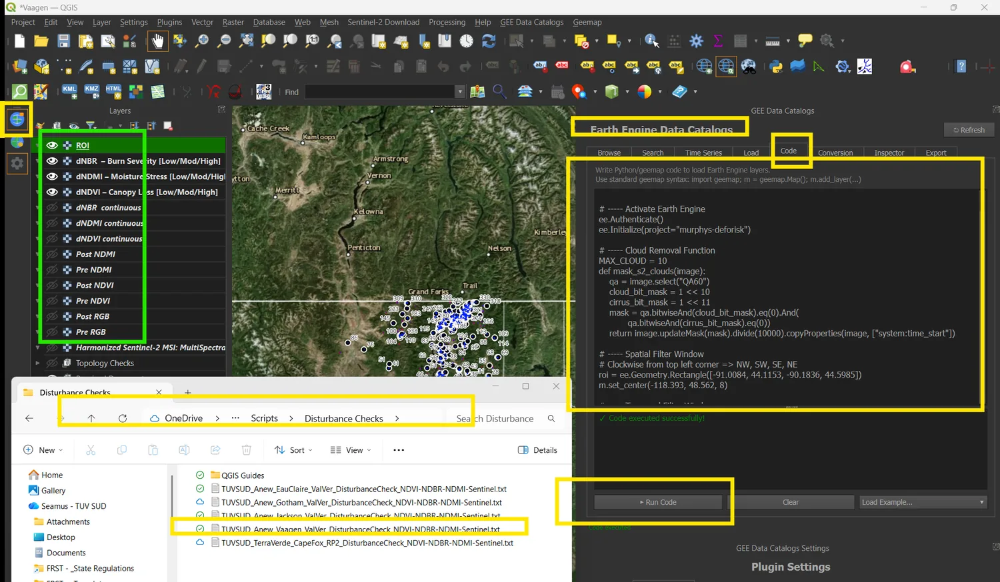
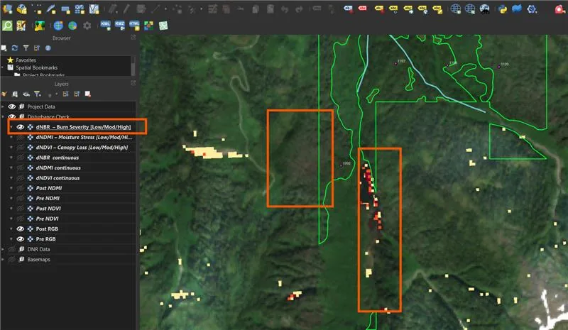
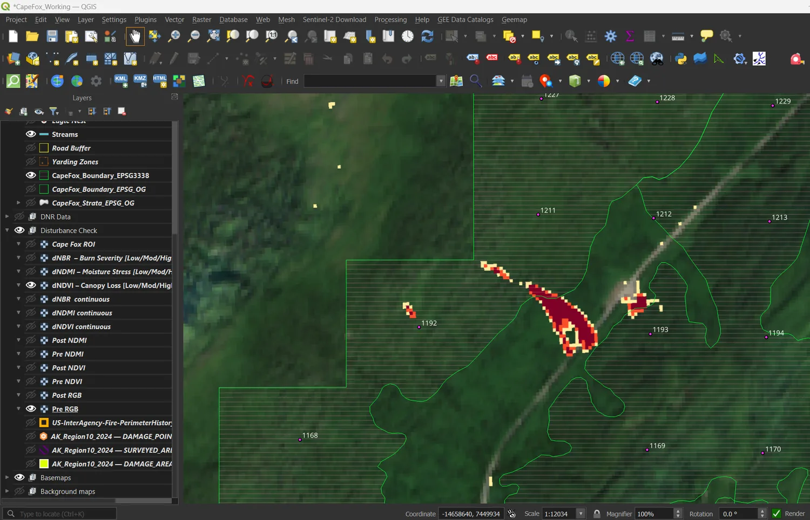
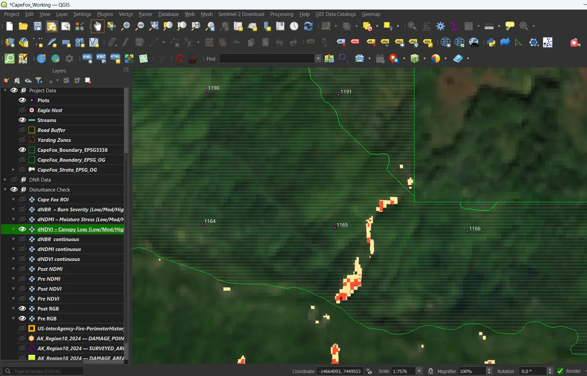

# Interpreting results

The tool detects spectral change. It does not detect disturbance. Everything
below is about telling the two apart, which is the whole of the job.

## What each index measures

**dNDVI** is the change in vegetation greenness. It falls when canopy is
removed, so a positive dNDVI means canopy was lost between the pre and post
windows. It is the primary canopy-loss signal.

**dNDMI** is the change in vegetation water content, using the shortwave
infrared band. It responds to moisture stress before greenness drops, which
makes it the earliest warning for drought, beetle attack and pathogens. It is
also the index most easily fooled by seasonal timing.

**dNBR** is the change in the burn index. It is the standard fire severity
measure used by MTBS and the USFS. Its main value here is as a control: it tells
you whether canopy loss was fire.

All three are differenced so that **positive means change of interest**. This is
worth remembering because dNBR is computed post minus pre while the other two
are pre minus post.

## The four classes

Undisturbed, Low, Moderate and High. Undisturbed pixels are transparent, so
anything you can see on the classified layer is, by definition, at or above the
Low threshold.

Coloured cells are not findings. They are candidates.

## Read the histogram before the map

This is the single most important habit, and skipping it has produced a wrong
finding before. The histogram shows how many pixels fall at each value of the
difference. Its shape tells you whether the coloured cells on the map mean
anything.

**Unimodal, centred on zero, narrow tail.** Most pixels barely changed and the
tail dies away quickly. This is a clean result with no disturbance. The defaults
hold. If a few isolated cells still show, they are worth a look but the site is
substantially undisturbed.

**Bimodal, with a clear gap.** A large peak at zero, then a gap, then a second
smaller population further right. This is the signature of real disturbance: a
set of pixels behaving quite differently from the rest. Put the Low threshold
inside the gap rather than on the default. The tool marks the suggested position
with a dashed green line.

**Unimodal with a long right tail and no gap.** The peak is at zero but the
distribution keeps carrying weight far to the right with nothing separating
signal from noise. **This is not disturbance.** It means the two composites are
not comparable, and the usual causes are cloud shadow, seasonal timing, or
viewing-angle effects. The tool raises a warning and reports what percentage of
the area is being flagged.

*This is the shape to distrust. The default 0.05 break, marked in yellow, sits
on the shoulder of the noise bulk rather than beyond it, which is why 38% of the
area came back flagged. The red lines are where the breaks were moved to.*

Do not respond to this shape by raising the thresholds until the map looks
sensible. Fix the input instead: check that both windows are in the growing
season, check they cover the same months, and consider tightening the clear-pixel
threshold.

**Peak not centred on zero.** The whole distribution is shifted. That is a
systematic offset between the two composites, not localised change anywhere.

## The worked example behind the warnings

A first-pass check once flagged about 38% of a project area as moisture-stressed
under the default thresholds. The pattern was diffuse, with no relationship to
stand age, aspect or known beetle pressure, which was the first clue.

The histogram was unimodal with a long right tail and no gap. The cause turned
out to be the reporting calendar: both composites had been drawn from October to
December windows. In that season senescence drives shortwave infrared
reflectance up before leaf-fall, producing a uniform false moisture-stress
signal across the whole site. The default Low threshold sat on the shoulder of
the noise bulk and reclassified ordinary autumn phenology as disturbance.

Re-running with July to September windows collapsed the flagged area from 38% to
4%, all of it co-located with reported beetle survey polygons.

The lesson, and the reason the tool warns about dormant-season windows: when the
histogram is unimodal with a long tail, audit the dates before touching the
thresholds.

## Cross-checking the three layers

Read them together. The combination tells you the cause.

**dNDVI high, dNBR clean.** Canopy was lost and it was not fire. Harvest,
blowdown, clearing or a landslide. Look at the shape of the polygon next.

**dNDVI high, dNBR also high.** Fire. Confirm against the official MTBS or NIFC
perimeter before raising anything, because the developer will produce it.

**dNDMI high, dNDVI and dNBR clean.** Moisture stress without canopy loss yet.
Drought, insects or disease. Corroborate with a drought monitor or a beetle
survey before calling it disturbance. On its own this is the weakest signal and
the most likely to be a timing artefact.

*Cape Fox, RP2. The dNBR pixels are scattered and spatially uncorrelated with
the dNDMI signal, which is what ruling out fire looks like. The finding that
followed was yellow-cedar decline, not burn.*

## Read the edges

Once you have a genuine canopy-loss polygon, its shape tells you whether a human
caused it.

**Straight edges, right angles, linear corridors.** Anthropogenic. Harvest
units, roads, rights of way. A long thin polygon with right-angled terminations
is a road or utility clearance almost every time.

**Curvilinear or amorphous edges.** Natural. Blowdown, decline, slides.

**An edge following the project boundary or a plot line.** Look carefully. This
is often harvest arriving from a neighbouring property, and whether it falls
inside or outside the boundary is exactly the question.

*Linear edges with right-angled terminations following plot lines and an
external cutblock perimeter. Road or right-of-way clearance, not a natural
event.*

*The same polygon closer in. The footprint runs from the plot interior toward
the project boundary, consistent with removal originating from neighbouring
cutblocks. This became a CAR asking the developer to confirm whether timber
removal occurred on site and how it was treated in the HWP accounting.*

This is why plot points are worth loading and labelling: it lets you name the
plot in the screenshot rather than describing a location in prose.

## Areas

The class-area table reports hectares per class, computed on a metric projection
rather than on latitude and longitude, which would understate area at high
latitudes.

Treat the totals as indicative. They are computed at 20 metre resolution, so
fragmented disturbance with a lot of edge is somewhat under-counted relative to
a 10 metre export. The share-of-area percentage is the more robust number for a
finding.

## Before you raise anything

1. The histogram shape supports the thresholds you used.
2. No unresolved warning in the panel.
3. You have cross-checked dNDVI against dNBR.
4. You have looked at the before-and-after true-colour composites over the
   polygon. Switch on the Pre RGB and Post RGB layers. Standing canopy in the
   pre image and bare ground in the post image is direct evidence, and it is
   what a developer will find persuasive.
5. Your screenshot includes both the classified layer and the cross-check layer.
   Auditors and developers expect to see the cross-check, not just the layer
   that raised the alarm.
6. You have the run manifest.

## When the check comes back clean

An absence of signal is not the end of the audit. A project reporting zero
harvest may still need to demonstrate that harvesting has not simply moved to
land elsewhere under the same ownership. The same check can be re-pointed at
those external holdings by setting the area of interest to them, and emerging
canopy loss there belongs in the leakage documentation rather than the project
disturbance ledger.
