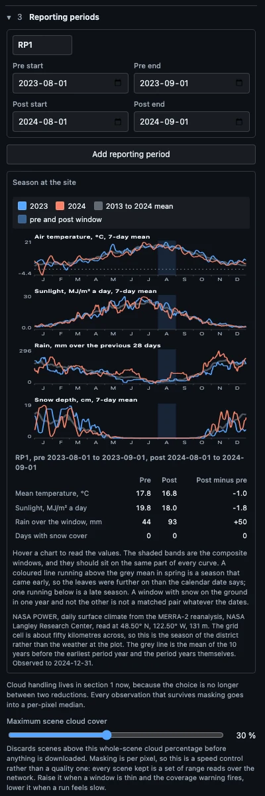
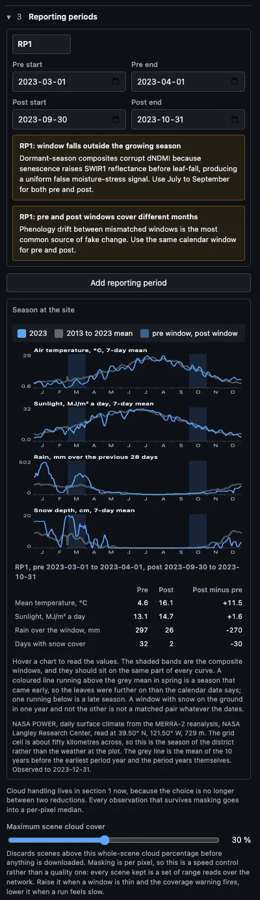
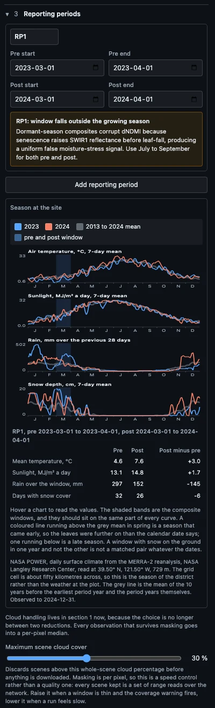
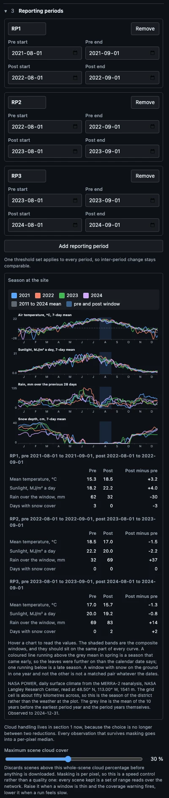

# Matching the season

Version 0.13.0 added the season charts under the reporting periods. This guide
says what they are for, what the three indices do through the year and why,
how to read the charts to confirm a pair of composite windows over one year
and over a chain of years, and which published work the practice rests on.

The order is the physics first, then the literature, then four worked examples
with screenshots, then the references.

## The subtraction

A pre-post delta is a subtraction. The tool builds one cloud-free composite
from every clear Sentinel-2 look inside the pre window, another from the post
window, and subtracts the index of the first from the index of the second at
every pixel. The result is a map of everything that changed between the two
composites, and disturbance is only one of the things that can change. The
sun sat at a different height. The leaves were at a different stage. The soil
held a different amount of water. Snow lay on the ground in one and not the
other. Each of those moves the index without a single tree being cut, and each
produces a delta that looks like disturbance, over the whole area at once.

The SOP's defence is to match the calendar dates of the two windows, so that
both composites sit at the same point of the year. The panel warns when they
do not. Matching dates is the right rule, but it rests on an assumption, that
the season ran on time in both years. A cold March delays leaf-out by a
fortnight; a hot dry August browns a canopy that was green the year before.
The season charts test that assumption against the daily climate at the site,
so the operator confirms the windows with data rather than with a calendar.

## Leaves and season

The three indices read different parts of the leaf, and each has its own
seasonal cycle.

**NDVI reads pigment and leaf area.** Leaf pigments absorb red light and the
spongy cell structure inside the leaf scatters near infrared strongly, so a
green canopy is dark in the red band and bright in the near infrared, and the
ratio between them rises with leaf area and chlorophyll (Knipling 1970; Tucker
1979). In a deciduous stand NDVI climbs steeply through leaf-out, holds a
plateau through summer, falls through senescence and reaches a floor in winter.
In a conifer stand it holds most of its value through winter, though snow and
low sun still pull it down. The amplitude of that cycle in a broadleaf stand is
several times the dNDVI threshold for high severity, which is why a
growing-season composite subtracted from a dormant-season one classifies the
whole stand as cleared. Satellite records of the cycle are old enough to have
become a standard measurement, with the onset of greenness, the peak, and the
rate of senescence read from index time series since the early AVHRR record
(Reed et al. 1994; Zhang et al. 2003).

**NDMI reads leaf water.** Liquid water in the leaf absorbs shortwave infrared
at 1.6 micrometres, Sentinel-2 band 11, so a well-watered canopy is dark there
and a dry one is bright (Gao 1996; Ceccato et al. 2001). NDMI pairs that band
with the near infrared and tracks canopy water content, which is what makes it
useful for harvest and thinning (Wilson and Sader 2002; Jin and Sader 2005).
The same sensitivity makes it the index most easily fooled by season. Drought
raises shortwave infrared reflectance while the leaves are still on, so a dry
August reads as moisture stress against a wet one. Senescence raises it before
leaf fall, which is the false uniform signal the SOP warns of for
dormant-season composites. Snow is the reverse case, very bright in the visible
and near infrared and dark in the shortwave infrared, so a snow-covered pre
composite swings the delta the other way.

**NBR reads char and exposed ground.** NBR pairs the near infrared with the
longer shortwave infrared at 2.2 micrometres, band 12. Fire removes canopy, so
the near infrared falls, and exposes char, ash and soil, so the shortwave
infrared rises, and the differenced index is the standard measure of burn
severity (Key 2006; Roy et al. 2006). It drifts with season in unburned forest
too. Verbyla et al. (2008) found in Alaskan black spruce that "NBR values
consistently decreased from June through September" in unburned pixels, and
that dNBR from similar unburned and burned stands "were substantially higher
from September imagery relative to July or August imagery", which is a change
in the classified severity produced by the date alone. Key (2006) listed the
same hazards for the end of a fire season, "low sun angles, vegetation
senescence, incomplete burning, hazy conditions, or snow", and Veraverbeke et
al. (2010) took the timing of the pre and post acquisitions as the subject of
a whole study over the 2007 Peloponnese fires.

**The sun moves too.** A window later in the year has a lower sun, longer
shadows and less light reaching the ground, and in rough terrain that changes
the reflectance of every slope without any change in the canopy. Verbyla et
al. (2008) found a "negative bias in remotely sensed fire severity estimates
as potential solar radiation decreased owing to topography", strongest in
valley bottoms and on steep north-facing slopes. The sunlight chart is there
so this is seen. Two windows on the same dates receive the same sun geometry;
two windows a month apart do not, and no amount of cloud masking corrects it.

**Climate sets the timing.** The dates on which a stand leafs out and browns
off are not fixed. White et al. (1997) modelled them from weather across the
continental United States and found that "onset was strongly associated with
temperature summations in both grassland and DBF biomes", while the end of the
season in broadleaf forest followed day length and in grassland followed
rainfall and temperature together, with the growing season varying by more
than two weeks between years. Piao et al. (2019) reviewed two decades of
ground and satellite records and found general agreement on "the trends of
advanced leaf unfolding and delayed leaf coloring due to climate change". That
is the reason the charts show temperature, sunlight and rain rather than a
calendar. The same date in two years is the same point of the season only when
the accumulated warmth, the light and the water that reached the canopy were
alike.

## The literature

Matching the season of the two images is the oldest rule in digital change
detection. The reviews that defined the field, from Singh (1989) to Lu et al.
(2004), treated the choice of image dates as part of the design rather than a
detail of acquisition, and Coppin et al. (2004) named "the appropriate choices
for digital imagery acquisition timing and change interval length definition"
as one of the questions a change detection study has to answer before any
algorithm is chosen.

When the unit of analysis became the composite rather than the scene, the
rule moved into the compositing itself. Griffiths et al. (2013) scored every
candidate pixel by its distance from a target day of year, so that a composite
is "seasonally and radiometrically consistent" across a large area, and White
et al. (2014) built the Canadian best-available-pixel composites on the same
target-date principle, with the recommendation that compositing decisions be
tied to the information need. The windows in this tool are that target date,
expressed as a range, and the panel's warning that the pre and post windows
cover different months is the same rule applied.

Methods that read a whole time series rather than a pair go further and model
the seasonal cycle explicitly, so that change is measured as a departure from
the expected curve rather than from a single earlier image. Verbesselt et al.
(2010) separated trend from season before testing for breaks; Zhu and Woodcock
(2014) fitted harmonic curves to every clear observation and flagged
disturbance where new observations left them; Kennedy et al. (2010) built the
LandTrendr record from one summer composite per year so that the yearly values
were comparable by construction. Zhu (2017) and Woodcock et al. (2020) reviewed
that shift from two-date detection to continuous monitoring. This tool is a
two-date method, so it cannot model the curve. What it can do is show the
curve's drivers beside the two dates, which is what the season charts are.

## Reading the charts

Every chart runs from January to December. Each reporting-period year is a
coloured line, the mean of the ten years before the earliest period year is
grey, and the composite windows are shaded by month and day, so matching
windows shade one band and mismatched windows shade two. Hover to read values.

**Air temperature** is a seven-day mean. In spring, a coloured line above the
grey mean is an early season and one below is a late one. In summer, a line
well above the mean is a heat spell that stresses a canopy.

**Sunlight** is the shortwave energy reaching the surface, also a seven-day
mean. It carries both the sun's height and the cloud, and two windows should
sit at the same level of it.

**Rain** is the total over the previous four weeks, because greenness follows
the water that has arrived recently rather than the rain on the day. A window
after a dry month and a window after a wet one are not a matched pair in NDMI.

**Snow depth** is drawn only where the record holds any snow. A window with
snow on the ground in one year and bare ground in the other is not a matched
pair whatever the dates.

The table under the charts gives, for each period, the mean temperature, mean
sunlight, total rain and count of snow days inside the pre window and the post
window, and the post-minus-pre difference. No threshold is applied, because
what counts as a large gap depends on the forest. The same numbers are written
to the manifest so a finding can quote them.

The grid behind the charts is about fifty kilometres across, so the values are
the season of the district rather than the weather at the plot. That is the
right scale for the question, which is about timing rather than any one day.

## One year, matched

A single reporting period is two composites. The example is a coastal Pacific
Northwest site at 48.5 degrees north, with the default August window in both
years.

Both windows fall on the same dates, so one band is shaded, and it sits on the
summer plateau of temperature and sunlight in both years. The two coloured
lines run together through August. The table confirms it.

| | Pre, 2023 | Post, 2024 | Post minus pre |
|---|---|---|---|
| Mean temperature, °C | 17.8 | 16.8 | -1.0 |
| Sunlight, MJ/m² a day | 19.8 | 18.0 | -1.8 |
| Rain over the window, mm | 44 | 93 | +50 |
| Days with snow cover | 0 | 0 | 0 |

A degree of temperature and a tenth of the sunlight are the ordinary
difference between two summers. The rain differs more, and that is the number
to keep in mind when reading dNDMI. A wetter post window means a slightly
wetter canopy, so a small negative dNDMI signal across the whole area is
season rather than stress, and the histogram should be read for a uniform
offset before any pixel is classified. Nothing here says the windows should
move. Run.

## One year, mismatched

The example that prompted the feature. A Californian project with a reporting
period from 1 January to 31 December, and a first attempt at windows of 1
March to 1 April for the start and 30 September to 31 October for the end.

Two bands are shaded, and they sit on opposite sides of the year. The table
makes the size of the problem plain.

| | Pre, March | Post, October | Post minus pre |
|---|---|---|---|
| Mean temperature, °C | 4.6 | 16.1 | +11.5 |
| Sunlight, MJ/m² a day | 13.1 | 14.7 | +1.6 |
| Rain over the window, mm | 297 | 26 | -270 |
| Days with snow cover | 32 | 2 | -30 |

The pre composite was built with snow on the ground on every day of its
window and nearly three hundred millimetres of rain in the month. The post
composite was built at the end of the dry season. Every index would move over
the whole area, and the delta would report the drying of a Mediterranean
summer as disturbance. The fix is the SOP's own rule. Use the same calendar
window at the start and the end of the reporting period, so that a period
running 1 January to 31 December is screened with, for example, 1 March to 1
April in the first year against 1 March to 1 April in the next, or better,
with the growing-season default in both years. The period's own start and end
dates are the accounting boundary, not the imaging dates.

## A late spring

Two windows on matching dates can still fail. The same Californian site, with
1 March to 1 April in 2023 against the same dates in 2024.

One band is shaded, so the dates pass the calendar rule. The lines do not
agree inside it. The 2023 line runs below the 2024 line and below the grey
mean through March, and the snow chart shows cover lasting into April in 2023.

| | Pre, 2023 | Post, 2024 | Post minus pre |
|---|---|---|---|
| Mean temperature, °C | 4.6 | 7.6 | +3.0 |
| Sunlight, MJ/m² a day | 13.1 | 14.8 | +1.7 |
| Rain over the window, mm | 297 | 152 | -145 |
| Days with snow cover | 32 | 26 | -6 |

Spring 2023 in the Sierra foothills was cold, wet and late, and spring 2024
was not. A deciduous canopy at 1 April 2023 was two or three weeks behind the
same canopy at 1 April 2024, so the post composite is greener than the pre
composite across the whole area for reasons that have nothing to do with the
forest. The delta would read as recovery, and a real clearing inside it would
be under-classified by the same amount. Two remedies, in order. Move both
windows into the growing season, where the plateau makes a fortnight's
difference in timing matter far less, which is why the SOP's default is
August. If a spring window is required, hold the post window and move the pre
window later, a week at a time, until the 2023 line meets the 2024 line on the
temperature chart and the snow has gone in both, and record the shift and the
reason in the finding. The manifest carries the numbers either way.

## Several years

A verification over a chain of reporting periods builds a stack of yearly
composites on one grid, one layer per window, and the deltas are taken between
neighbouring layers. Some workflows call this a data cube. The stack is only
comparable if every layer sits at the same point of the season, and the charts
show all the layers' years at once. The example is a Montana site at 1541
metres with three chained periods, 2021 to 2022, 2022 to 2023 and 2023 to
2024, on the August window.

Four lines, one band. The band sits on the summer plateau in every year, so
the calendar rule holds across the whole chain. The tables show where the
years differ.

| Period | Temperature | Sunlight | Rain | Snow days |
|---|---|---|---|---|
| RP1, 2021 to 2022 | +3.2 | +4.0 | -30 | -3 |
| RP2, 2022 to 2023 | -1.5 | -2.2 | +37 | 0 |
| RP3, 2023 to 2024 | -1.3 | -0.8 | +14 | +2 |

RP1 is the one to read carefully. August 2022 was three degrees warmer, a
fifth sunnier and half as wet as August 2021, and the rain chart shows the
four-week total falling to near zero through the 2022 window. A canopy under
that much more heat and that much less water reads drier in the shortwave
infrared, so the RP1 dNDMI will carry a uniform stress signal over the whole
area that the RP2 dNDMI, taken into a cooler and wetter August, partly
reverses. Neither is disturbance. The histogram for RP1 should show it as a
shifted bulk rather than a tail, and the classes should be read against that
shift. Because one threshold set applies to every period, a class boundary
that fits RP1 will not fit RP2, and the drift between them is what the
justification field is for.

The August window is still the right one. Moving it would not remove a drought,
and the alternative, a different window for each period, breaks the
comparability the chain exists to provide. What the charts add is the reason
the RP1 layer differs, in numbers the finding can cite.

## What to record

Three things go into the finding. The window dates, which the manifest
already carries. The pre and post climate for each period, which the manifest
now carries under "Season at the site". And, where a window was moved from the
default or from the period boundary, the reason, in the justification field
or in the finding text, with the chart values that prompted it.

## References

Ceccato, P., Flasse, S., Tarantola, S., Jacquemoud, S. and Grégoire, J.-M.
(2001). Detecting vegetation leaf water content using reflectance in the
optical domain. Remote Sensing of Environment 77(1), 22 to 33.
https://doi.org/10.1016/S0034-4257(01)00191-2

Coppin, P., Jonckheere, I., Nackaerts, K., Muys, B. and Lambin, E. (2004).
Digital change detection methods in ecosystem monitoring: a review.
International Journal of Remote Sensing 25(9), 1565 to 1596.
https://doi.org/10.1080/0143116031000101675

Gao, B.-C. (1996). NDWI, a normalized difference water index for remote
sensing of vegetation liquid water from space. Remote Sensing of Environment
58(3), 257 to 266. https://doi.org/10.1016/S0034-4257(96)00067-3

Griffiths, P., van der Linden, S., Kuemmerle, T. and Hostert, P. (2013). A
pixel-based Landsat compositing algorithm for large area land cover mapping.
IEEE Journal of Selected Topics in Applied Earth Observations and Remote
Sensing 6(5), 2088 to 2101. https://doi.org/10.1109/JSTARS.2012.2228167

Jin, S. and Sader, S. A. (2005). Comparison of time series tasseled cap
wetness and the normalized difference moisture index in detecting forest
disturbances. Remote Sensing of Environment 94(3), 364 to 372.
https://doi.org/10.1016/j.rse.2004.10.012

Kennedy, R. E., Yang, Z. and Cohen, W. B. (2010). Detecting trends in forest
disturbance and recovery using yearly Landsat time series: 1. LandTrendr,
temporal segmentation algorithms. Remote Sensing of Environment 114(12), 2897
to 2910. https://doi.org/10.1016/j.rse.2010.07.008

Key, C. H. (2006). Ecological and sampling constraints on defining landscape
fire severity. Fire Ecology 2(2), 34 to 59.
https://doi.org/10.4996/fireecology.0202034

Knipling, E. B. (1970). Physical and physiological basis for the reflectance
of visible and near-infrared radiation from vegetation. Remote Sensing of
Environment 1(3), 155 to 159.
https://doi.org/10.1016/S0034-4257(70)80021-9

Lu, D., Mausel, P., Brondízio, E. and Moran, E. (2004). Change detection
techniques. International Journal of Remote Sensing 25(12), 2365 to 2401.
https://doi.org/10.1080/0143116031000139863

Piao, S., Liu, Q., Chen, A., Janssens, I. A., Fu, Y., Dai, J., Liu, L., Lian,
X., Shen, M. and Zhu, X. (2019). Plant phenology and global climate change:
current progresses and challenges. Global Change Biology 25(6), 1922 to 1940.
https://doi.org/10.1111/gcb.14619

Reed, B. C., Brown, J. F., VanderZee, D., Loveland, T. R., Merchant, J. W. and
Ohlen, D. O. (1994). Measuring phenological variability from satellite
imagery. Journal of Vegetation Science 5(5), 703 to 714.
https://doi.org/10.2307/3235884

Roy, D. P., Boschetti, L. and Trigg, S. N. (2006). Remote sensing of fire
severity: assessing the performance of the normalized burn ratio. IEEE
Geoscience and Remote Sensing Letters 3(1), 112 to 116.
https://doi.org/10.1109/LGRS.2005.858485

Singh, A. (1989). Digital change detection techniques using remotely-sensed
data. International Journal of Remote Sensing 10(6), 989 to 1003.
https://doi.org/10.1080/01431168908903939

Tucker, C. J. (1979). Red and photographic infrared linear combinations for
monitoring vegetation. Remote Sensing of Environment 8(2), 127 to 150.
https://doi.org/10.1016/0034-4257(79)90013-0

Veraverbeke, S., Lhermitte, S., Verstraeten, W. W. and Goossens, R. (2010).
The temporal dimension of differenced Normalized Burn Ratio (dNBR) fire/burn
severity studies: the case of the large 2007 Peloponnese wildfires in Greece.
Remote Sensing of Environment 114(11), 2548 to 2563.
https://doi.org/10.1016/j.rse.2010.05.029

Verbesselt, J., Hyndman, R., Newnham, G. and Culvenor, D. (2010). Detecting
trend and seasonal changes in satellite image time series. Remote Sensing of
Environment 114(1), 106 to 115. https://doi.org/10.1016/j.rse.2009.08.014

Verbyla, D. L., Kasischke, E. S. and Hoy, E. E. (2008). Seasonal and
topographic effects on estimating fire severity from Landsat TM/ETM+ data.
International Journal of Wildland Fire 17(4), 527 to 534.
https://doi.org/10.1071/WF08038

White, J. C., Wulder, M. A., Hobart, G. W., Luther, J. E., Hermosilla, T.,
Griffiths, P., Coops, N. C., Hall, R. J., Hostert, P., Dyk, A. and Guindon, L.
(2014). Pixel-based image compositing for large-area dense time series
applications and science. Canadian Journal of Remote Sensing 40(3), 192 to
212. https://doi.org/10.1080/07038992.2014.945827

White, M. A., Thornton, P. E. and Running, S. W. (1997). A continental
phenology model for monitoring vegetation responses to interannual climatic
variability. Global Biogeochemical Cycles 11(2), 217 to 234.
https://doi.org/10.1029/97GB00330

Wilson, E. H. and Sader, S. A. (2002). Detection of forest harvest type using
multiple dates of Landsat TM imagery. Remote Sensing of Environment 80(3), 385
to 396. https://doi.org/10.1016/S0034-4257(01)00318-2

Woodcock, C. E., Loveland, T. R., Herold, M. and Bauer, M. E. (2020).
Transitioning from change detection to monitoring with remote sensing: a
paradigm shift. Remote Sensing of Environment 238, 111558.
https://doi.org/10.1016/j.rse.2019.111558

Zhang, X., Friedl, M. A., Schaaf, C. B., Strahler, A. H., Hodges, J. C. F.,
Gao, F., Reed, B. C. and Huete, A. (2003). Monitoring vegetation phenology
using MODIS. Remote Sensing of Environment 84(3), 471 to 475.
https://doi.org/10.1016/S0034-4257(02)00135-9

Zhu, Z. (2017). Change detection using Landsat time series: a review of
frequencies, preprocessing, algorithms, and applications. ISPRS Journal of
Photogrammetry and Remote Sensing 130, 370 to 384.
https://doi.org/10.1016/j.isprsjprs.2017.06.013

Zhu, Z. and Woodcock, C. E. (2014). Continuous change detection and
classification of land cover using all available Landsat data. Remote Sensing
of Environment 144, 152 to 171. https://doi.org/10.1016/j.rse.2014.01.011
